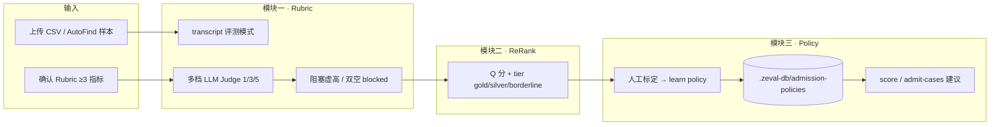

# Zeval 文档目录索引

本目录存放 Zeval 工程与 **v2.2 Benchmark 优化合并** 相关文档。  
若你的目标是**理解本次 merge 做了什么、为什么做、怎么验证**，请从下方「Merge 必读路径」开始。

仓库根目录另有：

- [`../README.md`](../README.md) — 项目快速上手
- [`../AGENTS.md`](../AGENTS.md) — 编码 Agent 规则（MVP 优先级、模块边界）

---

## Merge 必读路径（推荐阅读顺序）

按顺序阅读可在 30～60 分钟内建立完整上下文：**问题 → 方案 → 分工 → 实现 → 验证 → 合并**。

```text
① 问题从哪来          Zeval评测对齐会议纪要_20260609.md
        ↓
② 原始讨论细节        Zeval优化方案讨论.txt（可选，会议纪要补充）
        ↓
③ 根因与产品策略      admission-pool-strategy.html
        ↓
④ 章伟伟实现方案      zhangweiwei-work-plan.html
        ↓
⑤ 代码与验证现状      TestLog.md
        ↓
⑥ 合并清单与生产说明  v2.2-merge-changelog.md  ← merge 前最后一站
```

---

## v2.2 Merge 核心文档

| 优先级 | 文档 | 类型 | 内容摘要 | 何时阅读 |
|:------:|------|------|----------|----------|
| **P0** | [v2.2-merge-changelog.md](./v2.2-merge-changelog.md) | Markdown | **合并主文档**：三块模块 + AutoFind 改动清单、API、环境变量、Policy 生产生效时机、检查清单 | **merge / code review 前必读** |
| **P0** | [TestLog.md](./TestLog.md) | Markdown | **测试与验收依据**：单测用例 ID（M1/M2/M3）、smoke 命令、运行记录、`.zeval-db` 日志路径 | 验证实现是否达标；CI/本地回归 |
| **P1** | [Zeval评测对齐会议纪要_20260609.md](./Zeval评测对齐会议纪要_20260609.md) | Markdown | **问题与分工源头**：全 100 分根因、多档评分、三模型方差、ReRank、Policy、Roger/章伟伟分工 | 理解「为什么要改」 |
| **P1** | [admission-pool-strategy.html](./admission-pool-strategy.html) | HTML | **策略与设计蓝图**：区分度根因分析、UI 改造方向（Roger）、静态 Policy 引擎、图例与入池 channel 设计 | 深入 Policy / 入池产品设计 |
| **P1** | [zhangweiwei-work-plan.html](./zhangweiwei-work-plan.html) | HTML | **章伟伟三块执行方案**：Rubric / ReRank / Policy 排期、公式、验收标准、文件清单 | 对照实现是否覆盖方案 |
| **P2** | [Zeval优化方案讨论.txt](./Zeval优化方案讨论.txt) | 纯文本 | **会议原始转写**：兜底、fewshot、rerank、入池规则的口语细节 | 会议纪要存疑时查原文 |

### 优先级说明

| 标记 | 含义 |
|------|------|
| **P0** | merge 与验收直接相关，缺了无法判断能否合入 |
| **P1** | 理解背景、设计与分工，code review 时建议读过 |
| **P2** | 补充材料，按需查阅 |

---

## 本次 Merge 功能地图

三块模块 + AutoFind，对应会议分工中**章伟伟负责**部分（Roger 的 UI / 三模型评测为并行依赖）。



| 模块 | 解决什么问题 | 关键代码入口 | 文档章节 |
|------|--------------|--------------|----------|
| **一 · Rubric** | 全 100 分、yes/no 二元、评「二次 JSON」而非 transcript | `evaluators.ts` · `rubric-judge.ts` · `generic-run.ts` | work-plan §4 · TestLog §4 |
| **二 · ReRank** | good case 无高低 tier | `rerank.ts` · `runner.ts` | work-plan §5 · TestLog §5 |
| **三 · Policy** | 入池无规则、无法自动建议 | `admission-policy-*.ts` · `admit-cases` API | admission-pool-strategy · merge-changelog §6 |
| **AutoFind** | 预实验缺正负样本 | `autofind-data-skill.ts` · `/api/benchmarks/autofind` | merge-changelog §7 |

---

## 验证命令速查

实现与 merge 文档对齐的本地验证（详见 [TestLog.md](./TestLog.md)）：

```powershell
npm run test:benchmark              # 27 项单测
npm run test:benchmark:log          # 单测 + 写 .zeval-db/test-logs
npm run smoke:benchmark-rubric      # companion 离线区分度（无 API）
npm run smoke:admission-policy      # Policy learn/store/score
npm run smoke:benchmark-fullflow    # 真实 API 全流程（需 .env）
```

日志与产物：`.zeval-db/test-logs/`、`.zeval-db/admission-policies/`。

---

## Roger 并行项（不在本章伟伟 merge 范围，但阻塞部分能力）

| 项 | 负责人 | 影响 |
|----|--------|------|
| 两级标签 UI + 人工校验队列 | Roger | 真实 `labels` 产出 → Policy `learn` |
| 三模型混合评测 + `judgeVariance` | Roger | ReRank 方差 penalty、Policy uncertainty 规则 |
| 评测失败阻塞提示（产品层） | Roger | 与 `evaluators` blocked 状态对齐展示 |

详见 [会议纪要](./Zeval评测对齐会议纪要_20260609.md) 第三节、第四节。

---

## 其他工程文档（非 v2.2 专项）

以下为 Zeval 通用工程文档，与本次 Benchmark merge **无直接依赖**，按角色选用：

| 文档 | 受众 | 内容 |
|------|------|------|
| [engineering-status.md](./engineering-status.md) | 开发 | 整体实现状态、已知缺口、安全下一任务 |
| [roadmap-quality-loop.md](./roadmap-quality-loop.md) | 产品/开发 | 五阶段质量闭环路线图 |
| [product-brief-pm.md](./product-brief-pm.md) | PM | 产品定位与对外说明 |
| [data-architecture.md](./data-architecture.md) | 架构 | 组织/项目边界、存储适配器 |
| [design-guidelines.md](./design-guidelines.md) | 前端 | UI 主题与组件规范 |
| [changelog.md](./changelog.md) | 全员 | 历史实现变更日志 |
| [seed-user-interview-template.md](./seed-user-interview-template.md) | 产品 | 用户访谈脚本 |

---

## 文档维护约定

| 场景 | 更新哪份文档 |
|------|----------------|
| 单测 / smoke 结果 | `TestLog.md` §9 运行记录 |
| 新增或变更 merge 相关代码 | `v2.2-merge-changelog.md` |
| 产品策略或 Policy 规则变更 | `admission-pool-strategy.html` |
| 排期或验收标准变更 | `zhangweiwei-work-plan.html` |
| 会议结论或分工变更 | `Zeval评测对齐会议纪要_*.md` |

---

## 一句话总结

**v2.2 merge** 修复 Benchmark「全 100 分无区分度」，打通 **Rubric 多档评分 → ReRank 分层 → Policy 入池建议**，并用 **AutoFind** 提供 20 条正负预实验数据；**以 [v2.2-merge-changelog.md](./v2.2-merge-changelog.md) + [TestLog.md](./TestLog.md) 为合入与验收的最终依据**。
