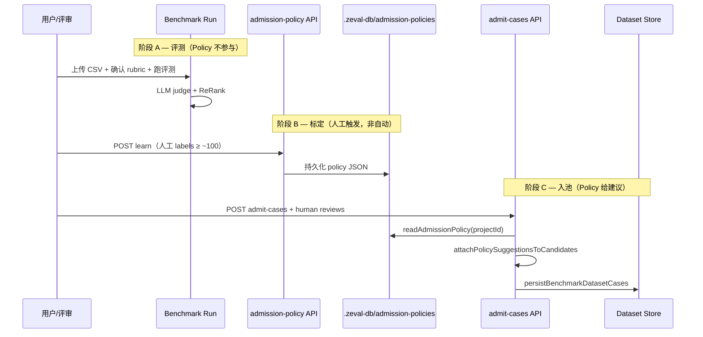

# Zeval v2.2 分支合并说明（章伟伟 · Benchmark 三块 + AutoFind）

更新日期：2026-06-10  
负责人：章伟伟  
关联：`TestLog.md` · `zhangweiwei-work-plan.html` · `admission-pool-strategy.html`

---

## 1. 合并摘要

本分支核心目标：**修复 Benchmark 全 100% 无区分度**，打通「Rubric 多档评分 → ReRank → 静态 Policy 入池建议」闭环，并交付 **AutoFind 正负样本数据工作流**。

| 范围 | 状态 | 说明 |
|------|------|------|
| 模块一 · Rubric / 评测器 | ✅ 可合并 | 多档分、阻塞虚高、transcript 模式、companion 验收 |
| 模块二 · ReRank | ✅ 可合并 | Q 分 / tier / runner 集成 |
| 模块三 · Policy 引擎 | ✅ 可合并 | 学习 / 判定 / store / API / admit-cases 建议 |
| AutoFind 数据技能 | ✅ 可合并 | API + Notebook UI + 20 sessions CSV |
| Roger 依赖项 | ⏳ 未含 | 两级标签 UI、`judgeVariance` 写入、Policy channel 与真实标定对齐 |

---

## 2. 真实 API 全流程验证（2026-06-10）

**命令：**

```powershell
$env:ZEVAL_FULLFLOW_MAX_CASES="4"
$env:ZEVAL_FULLFLOW_MAX_METRICS="3"
npm run smoke:benchmark-fullflow
```

**环境：** 根目录 `.env`（`ZEVAL_JUDGE_*`）+ `.zeval-db/` 本地存储。

**日志：** `.zeval-db/test-logs/fullflow-real-api/20260610-092229-fullflow-real-api.json`

| 项 | 结果 |
|----|------|
| 真实 LLM Judge（Qwen3.5-27B） | 4 cases × 3 metrics = 12 次调用成功 |
| 分数档位 | `uniqueScores: [1, 3]`（非退化满分） |
| pos / neg 均分 | 7.15 / 0（2 pos + 2 neg session） |
| Policy learn + store | 写入 `.zeval-db/admission-policies/default.json` |
| AutoFind search | 回退本地 `companion-autofind-20sessions.csv`，phase=searched |

**说明：** 当前 mock 标定 policy 的 channel（`ch_task_completion` 等）与 companion rubric channel（`ch_business_judgment` 等）**尚未对齐**，生产入池前需用真实人工标定重训 policy（见 §6）。

---

## 3. 模块一 · Rubric / 评测器

### 3.1 问题与方案

- **问题：** `exact_match` 双空给满分；LLM judge 连续分；二次生成 JSON 评 agent 而非 transcript。
- **方案：** 离散档位 snap、无 evidence 阻塞最高分；transcript 模式直接评历史助手轮次。

### 3.2 新增文件

| 文件 | 职责 |
|------|------|
| `src/benchmark/rubric-judge.ts` | `snapScoreToRubricLevels`、`shouldBlockMaxScoreWithoutEvidence` |
| `src/benchmark/rubric-guards.ts` | 跑数门禁 `MIN_APPROVED_METRICS=3`；建议 `RECOMMENDED=6` |
| `src/benchmark/transcript-benchmark.ts` | case/submission 构建；`ZEVAL_BENCHMARK_MAX_CASES` |
| `src/benchmark/companion-transcript-judge.ts` | 离线启发式 judge（smoke 用） |
| `src/benchmark/__fixtures__/rubric-companion-min.json` | 6 指标 companion rubric |
| `src/benchmark/__fixtures__/metric-results-mock.json` | 8×6 mock 指标结果 |
| `src/benchmark/evaluators.test.ts` | M1-01～06 |
| `src/benchmark/companion-transcript-judge.test.ts` | M1-E2E（20 sessions） |
| `scripts/smoke-benchmark-rubric.mts` | 离线 companion 区分度 smoke |
| `scripts/smoke-benchmark-fullflow-real-api.mts` | 真实 API 全流程 smoke |

### 3.3 修改文件

| 文件 | 改动要点 |
|------|----------|
| `src/benchmark/evaluators.ts` | LLM judge snap + 无 evidence 阻塞；导出 `normalizeScore` |
| `src/benchmark/generic-run.ts` | `ZEVAL_BENCHMARK_EVAL_MODE=transcript`；judge prompt 强制离散档 |
| `src/benchmark/copilot.ts` | 首轮建议 ≥6 指标；`useLlm` 失败**不再**回退稀疏模板 |
| `src/benchmark/rubric-agent.ts` | 指标 &lt;6 时 warnings 提示增补 |
| `src/benchmark/types.ts` | `BenchmarkRubricScoreLevel.fewshot`；`blocked` / `judgeVariance` |
| `src/benchmark/runner.ts` | `ZEVAL_BENCHMARK_MIN_METRICS` 门禁 |

### 3.4 环境变量

| 变量 | 默认 | 说明 |
|------|------|------|
| `ZEVAL_BENCHMARK_MIN_METRICS` | 3 | 开跑最少已确认指标数 |
| `ZEVAL_BENCHMARK_EVAL_MODE` | — | 设 `transcript` 启用历史 transcript 评测 |
| `ZEVAL_BENCHMARK_MAX_CASES` | 8 | 单次 run 最多 session 数；companion 验收设 20 |

---

## 4. 模块二 · ReRank

### 4.1 新增 / 修改

| 文件 | 职责 |
|------|------|
| `src/benchmark/rerank.ts` | `computeQualityScore`、`assignQualityTiers`、`rankCasesByMetric` |
| `src/benchmark/rerank.test.ts` | M2-01～06 |
| `src/benchmark/runner.ts` | `applyRerankToCaseScores` → `caseScores[].rerank` |
| `src/benchmark/types.ts` | `BenchmarkCaseRerank` |

### 4.2 Q 分与 Tier

- **Q 分：** Σ(w·norm·confidence) − 方差 penalty（`judgeVariance>0.35` 时触发，待 Roger 写入方差后生效）
- **Tier：** gold top 25% / silver / borderline

---

## 5. 模块三 · Policy 入池引擎

### 5.1 新增文件

| 文件 | 职责 |
|------|------|
| `src/benchmark/admission-policy-types.ts` | Label / Policy / Feature / Rule 类型 |
| `src/benchmark/admission-policy-learner.ts` | 分位数拟合 accept/reject/uncertainty |
| `src/benchmark/admission-scorer.ts` | reject→accept→human 判定链 |
| `src/benchmark/admission-feature-extractor.ts` | metricResults + rerank → 特征 |
| `src/benchmark/admission-policy-store.ts` | `.zeval-db/admission-policies/{projectId}.json` |
| `src/benchmark/admission-policy-holdout.ts` | 分层 holdout 一致率评估 |
| `app/api/benchmarks/admission-policy/route.ts` | learn / score / extract API |
| `src/benchmark/__fixtures__/human-labels-mock-100.json` | 100 条 mock 标定 |
| `src/benchmark/__fixtures__/policy-golden-v1.json` | 回归快照 |
| `src/benchmark/admission-*-*.test.ts` | M3-01～10 |
| `scripts/smoke-admission-policy.mts` | policy 管线 smoke |
| `scripts/generate-policy-golden.mts` | 生成 golden 快照 |

### 5.2 修改文件

| 文件 | 改动 |
|------|------|
| `src/benchmark/case-admission.ts` | `attachPolicySuggestionsToCandidates()` |
| `app/api/benchmarks/admit-cases/route.ts` | 入池时附加 `metadata.policySuggestion` |

### 5.3 API 契约

**GET** `/api/benchmarks/admission-policy?projectId=default`  
→ 读取已持久化 policy。

**POST** `/api/benchmarks/admission-policy`

| action | 体 | 行为 |
|--------|-----|------|
| `learn` | `{ projectId, labels[] }` | 学习并写入 `.zeval-db/admission-policies/` |
| `score` | `{ projectId, features[] }` | 对特征批量判定 accept/reject/human |
| `extract` | `{ metricResults[], rerankBySubmissionId? }` | 从评测结果抽特征 |

---

## 6. Policy 在生产环境何时 / 如何生效

### 6.1 生效时机（当前实现）

Policy **不会**在每次 Benchmark 跑分后自动学习或自动入池。生产链路分三阶段：



| 阶段 | 是否自动 | Policy 角色 |
|------|----------|-------------|
| A. Benchmark 评测 | 用户触发 run | **不生效**（仅产出 metricResults + rerank） |
| B. Policy 学习 | **需显式调用** `POST learn` | 从人工标定拟合 channel 规则，写入 store |
| C. 人工校验入池 | 用户提交 reviews | **建议生效**：`metadata.policySuggestion` |
| D. 批量打分 | 可选 `POST score` | 对任意 feature 列表返回 accept/reject/human |

### 6.2 判定逻辑（固定优先级）

1. 任一 **rejectRule** 命中 → `reject`
2. 否则全部 **acceptRule** 命中 → `accept`
3. 否则任一 **uncertaintyRule** 命中 → `human`
4. 否则 → `human`（兜底）

accept 规则 **AND**；reject / uncertainty 规则 **OR**。

### 6.3 入池时的具体行为

`POST /api/benchmarks/admit-cases`（`usePolicySuggestion` 默认 `true`）：

1. 根据用户 **人工 review** 构建 dataset candidate
2. `readAdmissionPolicy(context.projectId)` 读 policy
3. 若 policy 存在：对每个 candidate 写入  
   `metadata.policySuggestion = { decision, channel, matched*Rules }`
4. **不覆盖**用户人工 decision；建议供 UI / 审计 / 后续自动化参考

### 6.4 生产前置条件（合并后仍需补齐）

1. **真实标定数据：** mock 100 条 channel 与 companion rubric 不一致，需 Roger UI 产出 labels 后重新 `learn`
2. **channel 映射：** `extractAdmissionFeatures` 使用 `ch_{capability}`，标定数据的 channel 必须一致
3. **ReRank 特征：** `qualityPercentile` 依赖 `caseScores.rerank`，入池 runResult 需含完整 `caseScores`
4. **judgeVariance：** 三模型评测接入后 uncertainty 规则才完整生效

---

## 7. AutoFind 数据工作流

### 7.1 功能说明

轻量规则驱动工作流（**无 LLM**）：从公开数据集检索 **10 正 + 10 负** 多轮对话，导出 Zeval CSV。

| 样本 | 来源 |
|------|------|
| 正样本 | CPsyCounD（中文心理咨询多轮） |
| 负样本 | FailedESConv（低满意度英文对话，模拟流失） |
| 降级 | `public/sample-data/companion-autofind-20sessions.csv` |

### 7.2 涉及文件

| 文件 | 职责 |
|------|------|
| `src/benchmark/agent/skills/autofind-data-skill.ts` | 核心工作流：`start` / `search` / `save` / `chat` |
| `app/api/benchmarks/autofind/route.ts` | `POST` 代理 skill |
| `src/components/benchmark/NotebookLayout.tsx` | AutoFind 标签页、应用 CSV 到数据区 |
| `src/benchmark/agent/skills/index.ts` | skill 注册 |
| `public/sample-data/companion-autofind-20sessions.csv` | 预置 20 sessions（10 pos + 10 neg） |
| `.zeval-db/autofind-cache/` | 远程下载缓存 |
| `scripts/export-autofind-sample.mjs` | 导出 sample CSV 脚本 |

### 7.3 用户路径（Notebook）

1. 侧栏 Copilot → **AutoFind** 标签
2. 「开始搜索」→ `POST /api/benchmarks/autofind` `action=search`
3. 「保存」→ 写入 `public/sample-data/`
4. 「应用」→ 加载 CSV 到评测数据区 → 跑 Benchmark

---

## 8. 脚本与 package.json

```json
"test:benchmark": "node --import tsx --test ...",
"test:benchmark:log": "node --import tsx scripts/run-benchmark-tests-with-log.mts",
"smoke:benchmark-rubric": "离线 companion 区分度",
"smoke:benchmark-fullflow": "真实 API 全流程",
"smoke:admission-policy": "policy learn/store/score"
```

---

## 9. `.zeval-db` 运行时产物

| 路径 | 说明 |
|------|------|
| `.zeval-db/admission-policies/{projectId}.json` | 学习后的 Policy |
| `.zeval-db/test-logs/summary/` | 单测汇总 |
| `.zeval-db/test-logs/module1-rubric/` | Rubric smoke 日志 |
| `.zeval-db/test-logs/fullflow-real-api/` | 真实 API 全流程日志 |
| `.zeval-db/benchmark-sessions/` | Notebook 会话状态 |
| `.zeval-db/autofind-cache/` | AutoFind 远程数据缓存 |

---

## 10. 合并检查清单

- [ ] `npm run test:benchmark` — 27/27 通过
- [ ] `npm run smoke:benchmark-rubric` — pos 均分 &gt; neg 均分
- [ ] `npm run smoke:admission-policy` — holdout ≥ 70%
- [ ] `npm run smoke:benchmark-fullflow` — 真实 API（需 `.env`）
- [ ] 确认 `.env` **不提交**；仅 `.env.example` 进库
- [ ] 与 Roger 对齐：`judgeVariance`、两级标签 UI、Policy 真实标定 channel
- [ ] 合并后 README / TestLog §9 追加一行运行记录

---

## 11. 已知限制（不阻塞 merge）

1. Policy 学习**非自动**；无 UI「生成 Policy」按钮前需调 API 或 smoke 脚本
2. `admit-cases` 的 policy 仅为 **metadata 建议**，不自动拒绝入池
3. companion 真实 API 全流程中 neg 样本得分偏低（均分 0），需后续调 rubric / judge prompt
4. `MAX_DATASET_CASES` 默认 8；全量 20 sessions 需设环境变量

---

## 12. 文件清单（便于 code review）

<details>
<summary>点击展开完整路径列表</summary>

**模块一**
- `src/benchmark/rubric-judge.ts`
- `src/benchmark/rubric-guards.ts`
- `src/benchmark/transcript-benchmark.ts`
- `src/benchmark/companion-transcript-judge.ts`
- `src/benchmark/evaluators.ts`
- `src/benchmark/generic-run.ts`
- `src/benchmark/copilot.ts`
- `src/benchmark/rubric-agent.ts`
- `src/benchmark/evaluators.test.ts`
- `src/benchmark/companion-transcript-judge.test.ts`
- `src/benchmark/__fixtures__/rubric-companion-min.json`
- `src/benchmark/__fixtures__/metric-results-mock.json`

**模块二**
- `src/benchmark/rerank.ts`
- `src/benchmark/rerank.test.ts`
- `src/benchmark/runner.ts`

**模块三**
- `src/benchmark/admission-policy-types.ts`
- `src/benchmark/admission-policy-learner.ts`
- `src/benchmark/admission-scorer.ts`
- `src/benchmark/admission-feature-extractor.ts`
- `src/benchmark/admission-policy-store.ts`
- `src/benchmark/admission-policy-holdout.ts`
- `src/benchmark/admission-policy-learner.test.ts`
- `src/benchmark/admission-scorer.test.ts`
- `src/benchmark/admission-feature-extractor.test.ts`
- `src/benchmark/case-admission.ts`
- `app/api/benchmarks/admission-policy/route.ts`
- `app/api/benchmarks/admit-cases/route.ts`
- `src/benchmark/__fixtures__/human-labels-mock-100.json`
- `src/benchmark/__fixtures__/policy-golden-v1.json`

**AutoFind**
- `src/benchmark/agent/skills/autofind-data-skill.ts`
- `app/api/benchmarks/autofind/route.ts`
- `src/components/benchmark/NotebookLayout.tsx`
- `public/sample-data/companion-autofind-20sessions.csv`

**脚本 / 文档**
- `scripts/smoke-benchmark-rubric.mts`
- `scripts/smoke-benchmark-fullflow-real-api.mts`
- `scripts/smoke-admission-policy.mts`
- `scripts/run-benchmark-tests-with-log.mts`
- `scripts/generate-policy-golden.mts`
- `docs/TestLog.md`
- `docs/v2.2-merge-changelog.md`（本文档）

</details>
